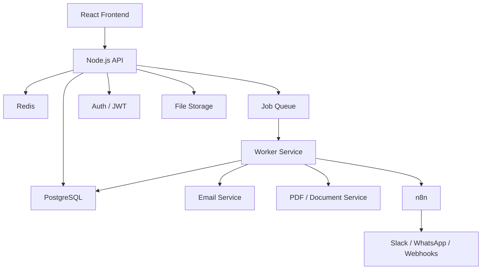
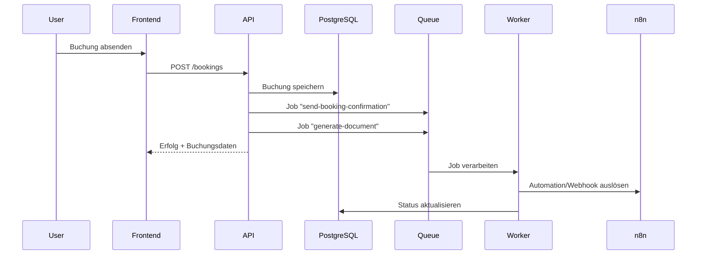

# Zielarchitektur – Professionelles SaaS-Setup

## Architektur auf einen Blick

## Komponenten

### Frontend
Stack:
- React
- TypeScript
- Tailwind
- optional React Query / Zustand

Aufgaben:
- Dashboard
- Equipment-Verwaltung
- Buchungen
- CRM
- Dokumente
- Tenant-Einstellungen

### Backend API
Stack:
- Node.js
- TypeScript
- Fastify

Aufgaben:
- REST API
- Auth prüfen
- Tenant-Kontext auflösen
- Validierung
- Geschäftslogik
- Jobs an Queue übergeben

### PostgreSQL
System of Record für:
- tenants
- users
- customers
- equipment
- bookings
- booking_items
- pricing_rules
- invoices
- documents
- locations

### Redis
Einsatz:
- Caching
- Rate Limiting
- Queue-Backend
- kurzfristige Statusdaten

### Queue + Worker
Wichtig für:
- E-Mails
- PDF-Erzeugung
- Reminder
- Webhooks
- asynchrone Prozesse

Typischer Stack:
- BullMQ
- Redis

### n8n
Rolle:
- Integrations- und Automationsschicht
- nicht Kern der Fachlogik

Geeignet für:
- Slack
- WhatsApp
- Google Calendar
- CRM-Integrationen
- Buchhaltungsworkflows

### File Storage
Für:
- Equipment-Bilder
- PDFs
- Rechnungen
- Angebote
- Verträge

Beispiele:
- S3-kompatibel
- Cloudflare R2
- Supabase Storage

## Beispielhafter Buchungsfluss

## Architekturregeln

1. Multi-Tenant von Anfang an
2. PostgreSQL statt NoSQL
3. Queue + Worker früh mitdenken
4. n8n nur für Integrationen, nicht für Kernlogik

## Entwicklungsphasen

### Phase 1
- Frontend
- API
- PostgreSQL
- Docker Compose

### Phase 2
- Worker
- Redis
- Object Storage
- CI/CD

### Phase 3
- Billing
- Monitoring
- Subdomains
- Audit Logs
- Feature Flags
