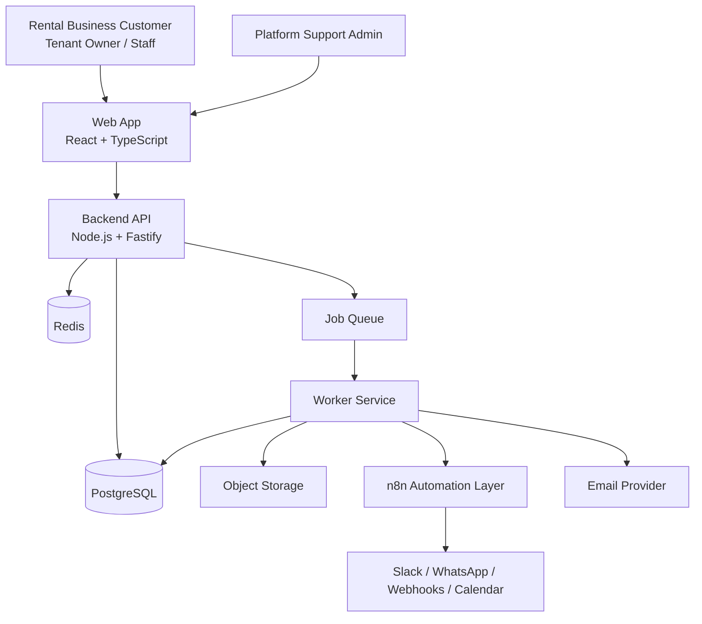
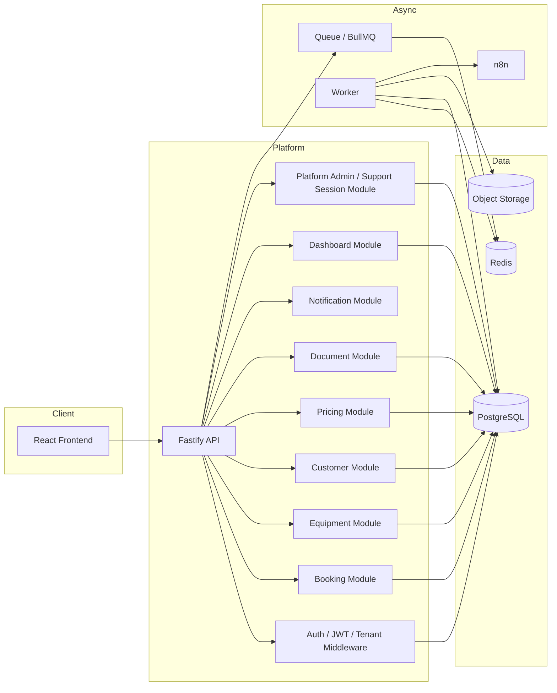
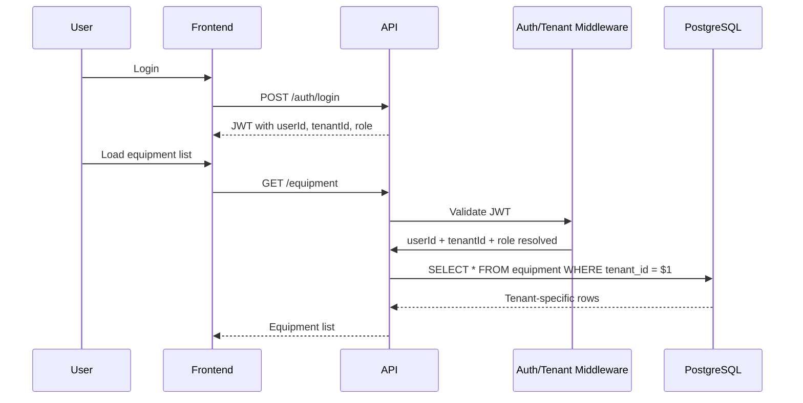
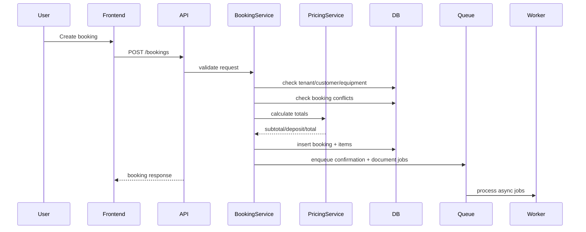
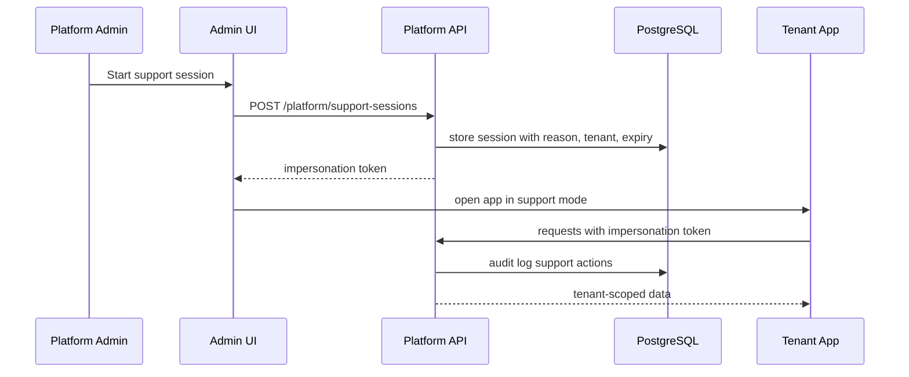
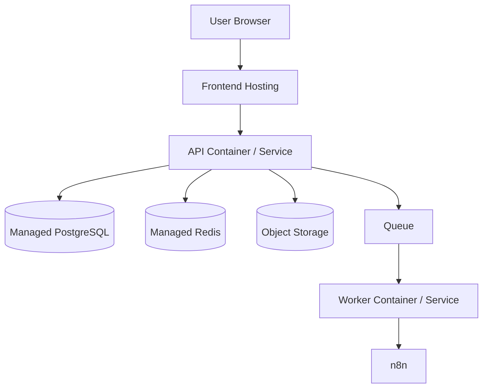

# Architekturdiagramme – Event Rental SaaS

## Ziel

Diese Datei enthält Architekturdiagramme in Markdown/Mermaid-Form für das SaaS-Projekt.  
Sie kann direkt in die Projektdokumentation übernommen werden.

---

## 1. System Context Diagram

### Erklärung
- **Customer** nutzt die SaaS-Plattform innerhalb seines Tenants
- **Support** nutzt kontrollierte Support-Sessions
- **Frontend** ist die Web-Oberfläche
- **API** enthält Kernlogik
- **PostgreSQL** speichert Fachdaten
- **Redis + Queue + Worker** verarbeiten asynchrone Aufgaben
- **Storage** speichert Bilder und PDFs
- **n8n** übernimmt Integrationen

---

## 2. Container Diagram

### Erklärung
Dieses Diagramm zeigt die logische Zerlegung in:
- **Frontend**
- **modular aufgebautes Backend**
- **asynchrone Verarbeitung**
- **Persistenz- und Storage-Schicht**

---

## 3. Tenant Isolation Flow

### Regel
Der Tenant-Kontext wird **nicht frei vom Frontend** geliefert, sondern aus JWT/Session abgeleitet.

---

## 4. Booking Creation Flow

### Fachliche Regel
- Konflikterkennung und Preislogik gehören ins Backend
- E-Mail/PDF/Reminder laufen asynchron

---

## 5. Support Session / Impersonation Flow

### Pflichtregeln
- Pflichtfeld `reason`
- zeitliche Begrenzung
- Audit Log
- sichtbarer Support-Modus
- kein versteckter Dauerzugriff

---

## 6. Deployment Diagram (MVP bis nächste Stufe)

### MVP Deployment
- Frontend
- API
- PostgreSQL
- optional Redis
- Docker Compose oder einfacher Cloud-Deploy

### Professioneller Ausbau
- API und Worker getrennt deployen
- Managed DB/Redis
- Storage
- CI/CD
- Monitoring
